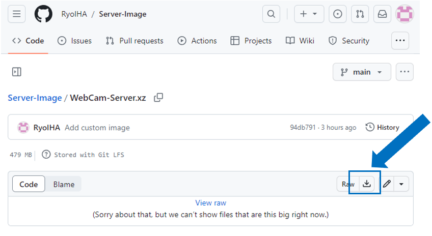
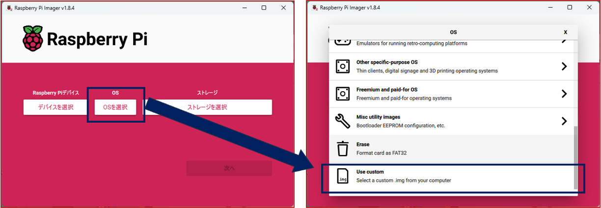

# WebCam セットアップガイド

このガイドは、Raspberry Piを使用してWebCamサーバーをセットアップする方法を説明します。手順に従って、教材インストール済みOSのインストールから環境の構築までを行ってください。

## アンケート回答のお願い
教材をご使用になる際には、使用前と使用後にアンケートへのご協力をお願いいたします。


[事後アンケート](https://forms.gle/dzUN9MFWpn4Qgbd8A)

## 内容

- 教材インストール済みOSイメージ(server.xz)
- 環境構築用スクリプトとファイル

## Raspberry PiにOSをインストールする

まず、Raspberry PiにOSをインストールします。このプロセスには、Raspberry Pi Imagerが必要です。

### Raspberry Pi Imagerの使用方法

[Raspberry Pi Imagerダウンロードページ](https://www.raspberrypi.com/software/)からRaspberry Pi Imagerをダウンロードし、インストールしてください。

### カスタムイメージのダウンロードについて

カスタムイメージはGitHub LFSを使用して管理されています。ダウンロード前に以下の手順を行ってください。

1. GitHubページからダウンロード
   「server.xz」のみをダウンロードすることが可能です。
   

2. [GitHub LFSのインストールガイド](https://docs.github.com/ja/repositories/working-with-files/managing-large-files/installing-git-large-file-storage)に従い、GitHub LFSをインストールします。

### Git LFSのインストール方法

- **Linux（Debian系）**: `sudo apt-get install git-lfs`
- **Linux（Red Hat系）**: `sudo yum install git-lfs`
- **Windows**: `git lfs install`
- **MacOS**: `brew install git-lfs`
- **以降共通の手順**:<br>
   `git lfs install`<br>
   `git clone <リポジトリのURL>`<br>
   `git lfs fetch`<br>
   `git lfs checkout`


### イメージのインストール
Raspberry Pi 4Bを使用します。
Raspberry Pi Imagerを開き、「Use custom」を選択して、ダウンロードしたカスタムイメージをMicroSDカードにインストールします。MicroSDカードは8GB以上を使用してください。



## セットアップ手順
事前にサーバー用Raspberry Piの準備を完了し、サーバー用Raspberry Pi起動に行なってください。
1. Raspberry Piを起動し、ユーザー名`pi`、パスワード`raspberry`でログインします。
2. ネットワーク設定を行います。`sudo raspi-config`を実行して設定してください。
3. `/home/pi/WebCam-Server/network-setup.sh`を実行し、設定ファイルの取得と設定を行います。
4. スクリプト実行後、プロンプトに従いサーバーのIPアドレスを入力してください。


以上の手順に従って、Raspberry Pi 4Bでカスタムイメージを使用したWebCam-Serverのセットアップを完了させてください。

## WebCam-Serverアクセスガイド

このガイドでは、WebCamにアクセスして画像を閲覧、保存する方法について説明します。

### 動作イメージのアクセス方法

**アクセス**  
   Webブラウザから`http://<WebCam-ServerのIPアドレス>`にアクセスしてください。`<WebCam-ServerのIPアドレス>`は、実際のWebCamのIPアドレスに置き換えてください。

**ログイン**  
   アクセスするとBasic認証の画面が表示されます。次の認証情報を入力してログインしてください。
   - **ID:** user
   - **PW:** password

**ホーム画面**  
   ログイン後、自動的にホーム画面に移動します。ここでは、現在のカメラ画像が表示されます。

**画像の保存**  
   アルバムページに移動し、「保存」ボタンを押すことで、現在表示されている画像を取得し、保存できます。

**画像の名前変更**  
   画像一覧から変更したい画像名を入力し、「変更」ボタンを押すことで、選択した画像に変更できます。

### 注意事項

- **アップデート機能の使用不可**  
  現在、アップデート機能は使用できません。

## スクリプトのみで準備する場合

以下の手順で環境構築を行なってください。ターミナルまたはコマンドプロンプトを開いて、以下のコマンドを実行してください。


`git clone <リポジトリのURL>`<br>
`cd WebCam-Server`<br>
`sudo sh server-setup.sh`<br>
`sudo bsh network-setup.sh`


以下の内容をGithubのREADMEとして使用出来るよう、IT技術の専門家として初学者にもわかるようにして
ただし、そのままコピーして使用出来るような形式で出力して
サーバーセットアップ手順

Raspberry Pi 4を使用します
ネットワーク接続は有線を使用してください
Wi-Fiアダプタを使用すれば無線でも可能です
実行手順
Raspberry Piの起動とログイン（ID=pi/PW=raspberry）
/home/pi/WebCam-Server/network_setup.shの実行


# サーバーセットアップ手順

このガイドでは、Raspberry Pi 4Bを使用してサーバーをセットアップする手順について説明します。
## ネットワーク接続

- 有線ネットワーク接続を使用します。

## 実行手順

1. **Raspberry Piの起動とログイン**
   - Raspberry Piを起動し、デフォルトのユーザーIDとパスワードを使用してログインしてください。
     - **ID:** pi
     - **PW:** raspberry

2. **ネットワーク設定スクリプトの実行**
   - ターミナルを開き、以下のコマンドを実行してください。これにより、ネットワーク設定が適用されます。
     ```bash
     /home/pi/WebCam-Server/network_setup.sh
     ```

この手順に従って、Raspberry Pi 4を使用したサーバーセットアップを完了させることができます。操作中に問題が発生した場合は、適切なサポートチームに連絡してください。

# サーバーセットアップ手順

このガイドでは、サーバー用Raspberry Piのセットアップ手順について説明します。事前にサーバー用Raspberry Piの準備を完了させ、サーバー用Raspberry Piの起動を行ってください。

## セットアップ手順

1. **Raspberry Piの起動とログイン**
   - Raspberry Piを起動し、ユーザー名`pi`、パスワード`raspberry`でログインします。

2. **ネットワーク設定の実行**
   - ネットワーク設定を行うために、以下のコマンドをターミナルで実行してください。
     ```
     sudo raspi-config
     ```
   - このツールを使用してネットワーク設定を完了させます。

3. **クライアント設定スクリプトの実行**
   - 次に、クライアント設定スクリプトを実行して、必要な設定ファイルの取得と設定を行います。
     ```
     /home/pi/WebCam/client_setup.sh
     ```

4. **サーバーIPアドレスの入力**
   - スクリプト実行後、プロンプトが表示されたら、サーバーのIPアドレスを入力してください。

これらの手順に従って、サーバー用Raspberry Piのセットアップを完了させることができます。操作中に不明点があれば、適切なサポートチームに連絡してください。


<!-- これはコメントです -->
